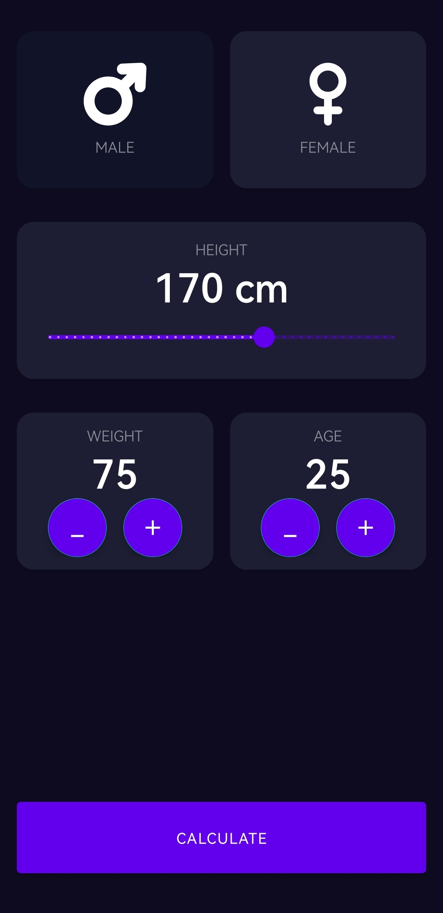
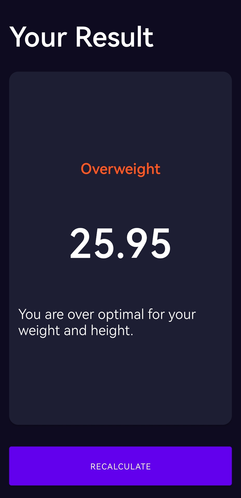

# BMI Calculator

## Overview
The BMI Calculator App is a user-friendly and efficient tool designed to calculate Body Mass Index (BMI) quickly and accurately. BMI is a widely recognized measure used to assess an individual's body composition in relation to their height and weight. This application aims to provide users with valuable insights into their health status and encourage healthy lifestyle choices.

### Key Features

- Easy Input:
The app allows users to input their weight and height in either metric or imperial units, making it convenient for users around the world.

- Instant Calculation:
Upon entering the required information, the app instantly calculates the BMI and categorizes it into standard BMI categories, such as underweight, normal weight, overweight, and obese.

- Visual Representation:
The BMI result is visually represented on a scale, helping users quickly understand where their BMI falls and providing a clear indication of their health status.

- Health Information:
The app not only provides the BMI value but also offers a brief description of each BMI category, explaining the potential health implications associated with different ranges.

### Benefits
- Quick and Accurate: The app swiftly computes the BMI, eliminating the need for manual calculations.
- Health Awareness: Users gain insight into their weight-related health status and are empowered to make informed decisions.

## UI Design
The designs of this app were inspired by [Ruben Vaalt.](https://dribbble.com/shots/4585382-Simple-BMI-Calculator). It is a multi screen app with simple functionality but full-on custom styling.

## Screenshots

